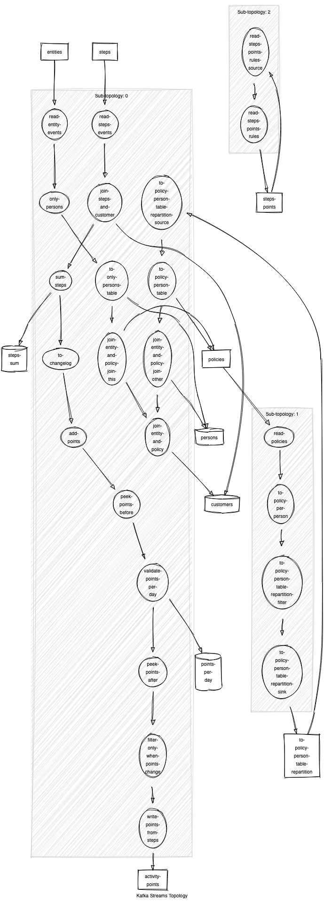

# Steps Manager

Turning incoming Steps into Activity Points.

## Steps to reproduce

1. Start environment `dc up -d` or `make start`.
2. Create topics `make topics`
3. Prepare initial dataset:
   1. Insert steps-to-points, running [`u.v.p.s.Producers$StepsPointsProducer`](src/main/java/uk/vitality/points/steps/Producers.java)
   2. Insert policies, running [`u.v.p.s.Producers$PoliciesProducer`](src/main/java/uk/vitality/points/steps/Producers.java)
   3. Insert entities, running [`u.v.p.s.Producers$EntitiesProducer`](src/main/java/uk/vitality/points/steps/Producers.java)
4. Run [Kafka Streams application](./src/main/java/uk/vitality/points/steps/Main.java)
5. Insert steps, running [`u.v.p.s.Producers$StepsProducer`](src/main/java/uk/vitality/points/steps/Producers.java)
6. Check results are arriving to `activity-points` topic.

## Latest topology graph

> Using <https://zz85.github.io/kafka-streams-viz/>